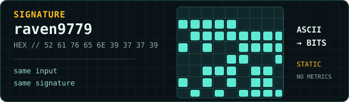

  

  <h1>Raven</h1>
  
<strong>Full-stack engineer</strong>

  
从界面到部署，把产品做成可运行的系统。

---

## PROFILE

我是 Raven，一名全栈工程师，专注把复杂需求收敛成可维护的产品路径：从可读的界面、可靠的 API 契约，到自托管部署与持续维护。目前正在构建个人发布系统，把公开阅读、受保护的写作后台和可部署的服务链路放在同一套长期可演进的系统中。日常使用 Next.js、TypeScript、Node.js、Docker、Nginx 与 AWS。

  

---

  <picture>
    <source media="(max-width: 600px)" srcset="assets/engineering-console-mobile.svg" />
    
  </picture>

---

  

