  

  <h1>Raven9779</h1>
  
<strong>Full-stack engineer</strong>

  
从界面到部署，把产品做成可运行的系统。

---

  <picture>
    <source media="(max-width: 600px)" srcset="assets/engineering-console-mobile.svg" />
    
  </picture>

---

## FOCUS

Full-stack systems · Self-hosted products · Product engineering

## NOW

正在构建个人发布系统，把阅读、内容管理与 API 部署放进同一条可维护的链路。

## STACK

  

